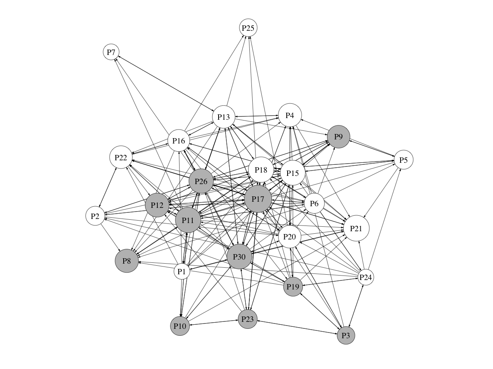
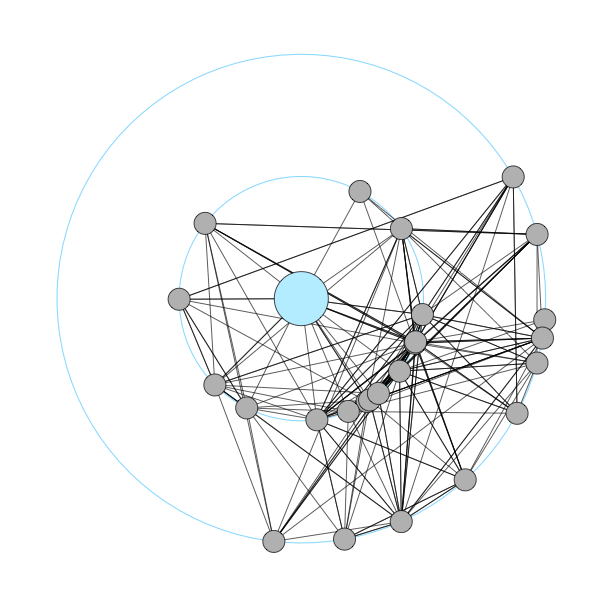
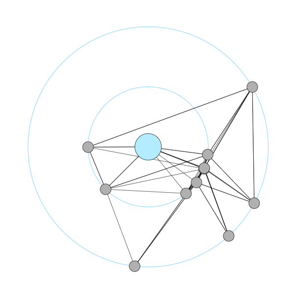

## ERGMs (Exponential Random Graph Models) to study industry clusters

###### This is a public repository for the article

Juhász, S. (2021): Spinoffs and tie formation in cluster knowledge networks. *Small Business Economics*, 56 (4), 1385-1404. 

[Abstract]
*It is generally acknowledged that in order to have access to locally accumulated industrial knowledge firms have to collaborate and take part in cluster knowledge networks. This study argues that the inherited capabilities of spinoff enable them to cooperate and exchange knowledge more easily and to gain more from positive knowledge externalities in clusters. The basis of the analysis is a relational dataset on a printing and paper product cluster in Hungary and I use exponential random graph models to explain the formation of knowledge ties. I demonstrate that besides geographical proximity, ownership similarity and network structural effects, being a spinoff company enhances tie formation in the local network. Results suggest that spinoffs are indeed more likely to collaborate and take advantage of knowledge concentration.*  

https://link.springer.com/article/10.1007/s11187-019-00235-9 

## Data

**Network**

The network (stored in matrix form) represents knowledge exchange between the firms in the printing and paper product cluster of Kecskemét, Hungary. 
The following question was used to collect relational data on knowledge sharing in the cluster:

*If you are in a critical situation and need technical advice, to which of the local firms mentioned in the roster do you turn?*

Therefore, the matrix represents an advice network, where companies in rows ask technical advice from companies in columns.
The network consists of 26 nodes (firms) and 223 edges. 
file: *network_data.csv* 
 

**Firm characteritics (properties)**

Different characteristics of firms (or network nodes) are also available.

'years_in_industry' := Years in industry (age or experience of firms 
'export_vol' := Export volume of firms (% of net revenue) 
'net_rev_cat' := Net revenue category (higher number means higher net rev) 
'f_owner' := foreign ownership dummy (1=foreign, 0=domestic company) 
'external_links' := Number of extra-regional knowledge ties (organizations) 
'spinoff' := spinoff dummy (1=spinoff, 0=non-spinoff company) 
'abroad_links' := Number of knowledge ties to abroad 
'main_field' := Categorical variable for the main activity of firms 
'petofi_spinoff' := Whether a company is a spinoff of the oldest printing press of the region, Petőfi Press 
file: *firm_properties.csv* 
 

**Similarity (proximity) of firms**

The geographical proximity of firms is measured as the distance of the selected pair of firms subtracted from the maximum physical distance between firms in the cluster (in km). As a result, the variable takes a higher value as the distance between firms diminishes. 
file: *geo_prox_matrix.csv* 

Cognitive proximity is made operational as the number of digits the two firms have in common in their 4-digit NACE codes. 
file: *cog_prox_matrix.csv*
 

## Scripts

file: *_ergm_models.R* 
The R script for my ERGM models. 
More about ERGMs. *https://statnet.org/trac/raw-attachment/wiki/Sunbelt2016/ergm_tutorial.html* 

file: *_network_visualization.R* 
The R script to visualize the network 
 
 The first figure represents spinoff companies in the cluster knowledge network. Spinoffs are maked by grey colour. The size of the nodes is proportional to in-degree. 
  

 
 
The next two figures shows the oldest local printing press as the focal node, and its ties in the full network (on the left) and its ties to spinoff companies only (on the right). 
These figures are made by the great *graphlayouts* package. 
link: *https://github.com/schochastics/graphlayouts* 
 

  

